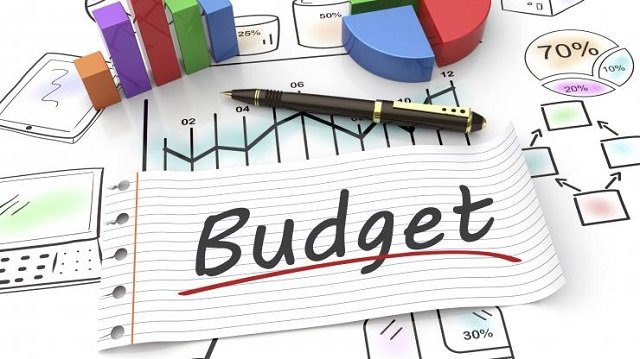
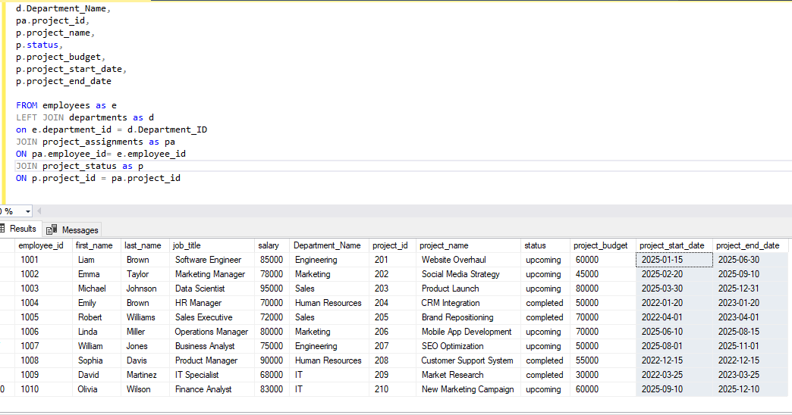

# Data Analysis Project: Budget Analysis Using Excel, SQL, Power BI

# Table of content

- [Objective](#objective)
- [Workflow](#Workflow)
- [Design](#design)
    - [Tools](#tools)
- [Development](#development)
    - [Pseudocode](#pseudocode)
    - [Data Exploration](#data-exploration)
    - [Data Cleaning](#data-cleaning)
    - [Data Transformation](#data-transformation)
    - [Create the SQL view](#create-the-sql-view)
- [Data Quality Test](#data-quality-test)
- [Visualization](#visualization)
  - [Results](#results)
  - [DAX Measures](#dax-measures)
- [Analysis](#analysis)
  - [Findings](#findings)
  - [Validation](#validation)
  - [Discovery](#discovery)
- [Recommendation](#recommendation)
  - [Potential ROI](#potential-roi)
  - [Action Plan](#action-plan)

## Objectives 
**Key point**
Sophia the HR manager wants to understand the company's expenditure to know which departments are over budget or underperforming. Which will help her effectively manage the company’s resources.

The objectives of this project are as follows:
- To visualize the project and department expenditures.
- Identify the budget performance for each department: Which departments are at risk of being over budget or underperforming?
- Build an interactive dashboard to visualize the salary and budget distribution.

**End users**
- Primary User: Sophia(HR Manager)
- Secondary users: team leads and the various Heads of Departments

**User story**
As the HR manager, I want to assess the company's budget, expenditures, and project health for each department. But the data are stored in different tables which makes analysis tedious. So I need a visual representation of the data and a big table that contains all the important information from each table.

**Success criteria**
Sophia can
* Easily identify the departments that are over budget and underperforming
* Asses the salary distribution and project health
* Make informed decisions about the budget allocation 

## Workflow
1. Get the data
2. Load the data into SQL server
3. Data Exploration
4. Data Cleaning and Transformation
5. Perform data quality checks
6. Create the dashboards in Power BI
7. Generate the findings based on the insights
8. Write the documentation + recommendation
9. Publish the data to Github pages

## Designs
**Features/Criteria**
The dashboard should:
- List all the employees and their salaries
- Track the projects' costs and project health.
- Be user-friendly and easy to sort/filter.

**Dashboard mockup**
Some of the data visuals that may be appropriate for answering our questions include:
1. Table
2. Treemap
3. Scorecards
4. Horizontal bar chart
    
### Tools 
| Tool | Purpose |
| ---- | ---- |
| Excel | Exploring the data |
| SQL Server | Cleaning, quality testing, and analyzing the data |
| Power BI | Visualizing the data via interactive dashboards |
| GitHub | Hosting the project documentation and version control |

## Development
1. **Get The Data**
The data was provided.

2. **Load the data into SQL server**
- Create a database
- Import flat file
- populate the database with the excel sheets

3. **Data Exploration**
This is the stage where you have a scan of what's in the data including errors, inconsistencies, corrupted characters, etc
Initial observations
* There are 6 different table including:
- Departments
- Employees
- Upcoming_projects
- Completed_projects
- Projects
- Project_assignments

* Some the columns we need are in different tables, so we need to join some of these tables to make a big table.And then drop the tables we don't need.

4. ** Data cleaning**
The aim is to refine our dataset to ensure it is structured and ready for analysis.
The cleaned data should meet the following criteria and constraints:
- Only relevant columns should be extracted.
- All data types should be appropriate for the contents of each column (e.g VARCHAR. INT)
- No column should contain null values, indicating complete data for all records.
Fortunately, the data is clean and structured with no null values. So we don’t need to spend any time cleaning.

## Data Transformation 

The major transformation to be done is joining the the tables

---SQL

-- big table
SELECT 
e.employee_id,
e.first_name,
e.last_name,
e.job_title,
e.salary,
d.Department_Name,
pa.project_id,
p.project_name,
p.status,
p.project_budget,
p.project_start_date,
p.project_end_date

FROM employees as e
LEFT JOIN departments as d
on e.department_id = d.Department_ID
JOIN project_assignments as pa
ON pa.employee_id= e.employee_id
JOIN project_status as p
ON p.project_id = pa.project_id
---

## Visualization

### Dashboard

## Analysis
### Findings
For this analysis, we will focus on the questions below to extract the information we need to provide insights.

Here are the questions we need to answer: 
1. What is the salary distribution?
2. What are the departments' expenditures?
3. Can a year’s budget cover all expenses for each department?
4. Which departments are at risk of being over budget or underperforming?

### 1. What is the salary distribution?			
				
|First Name |Last Name	|Department	|Salary	        |Salary distribution|
|-----------|-----------|-------------|-----------------|-------------------|
|Michael    |Johnson	|Sales	      |$95,000.00	|11.93%             |
|Sophia	    |Davis	|HR	      |$90,000.00	|11.31%             |
|Liam	    |Brown	|Engineering  |$85,000.00	|10.68%             |
|Olivia	    |Wilson	|IT	      |$83,000.00	|10.43%             |
|Linda	    |Miller	|Marketing    |$80,000.00	|10.05%             |
|Emma	    |Taylor	|Marketing    |$78,000.00	|9.80%              |
|William    |Jones	|Engineering  |$75,000.00	|9.42%              |
|Robert	    |Williams	|Sales	      |$72,000.00	|9.05%              |
|Emily	    |Brown	|HR	      |$70,000.00	|8.79%              |
|David	    |Martinez	|IT	      |$68,000.00	|8.54%              |
		
		
|Department	|Total salary |Salary distribution|
|-------------|---------------|-------------------|
|Engineering  |$160,000.00	|20.10            |
|Marketing    |$158,000.00	|19.85            |
|Sales	      |$167,000.00	|20.98            |
|HR	      |$160,000.00	|20.10            |
|IT	      |$151,000.00	|18.97            |
|Total        |$796,000.00			  |

From the tables above, engineering and HR departments are compensated more with 20.1o%. While the IT department is the least compensated with 18.97%. 

		
### 2. What are the department's expenditures?	
**Project costs**
|Department |Project cost  |	Budget              |
|-----------|---------------|-----------------------|
|Engineering|Website Overhaul		 |$60,000.00|
|	    |SEO Optimization	   	 |$50,000.00|
|	    |				 |$110,000.00
|Marketing  |Social Media Strategy 	 |$45,000.00|
|	    |Mobile App Development	 |$70,000.00|
|	    |				 |$115,000.00|
|Sales	    |Product Launch    		 |$80,000.00|
|	    |Brand Repositioning	 |$70,000.00|
|	    |			         |$150,000.00|
|HR	    |CRM Integration		 |$50,000.00|
|	    |Customer Support System	 |$55,000.00|
|	    |				 |$105,000.00|
|IT	    |Market Research		 |$30,000.00|
|	    |New Marketing Campaign	 |$60,000.00|
|	    |				 |$90,000.00|

**Total Expenditure**			
|Department  |Project cost   |Salary            |Total	    |
|------------|---------------|------------------|-----------|
|Sales	     |$150,000.00    |$167,000.00	|$317,000.00|
|Engineering |$110,000.00    |$160,000.00	|$270,000.00|
|Marketing   |$115,000.00    |$158,000.00	|$283,000.00|
|HR	     |$105,000.00    |$160,000.00	|$265,000.00|
|IT	     |$90,000.00     |$51,000.00	|$241,000.00|

Sales, engineering, and marketing have the highest expenditures. Therefore, more resources should be budgeted for these departments. IT has the least expenditure.

### 3. Can a year’s budget cover all expenses for each department?

|Department  |Total Expenditure	|Budget(one year) |Balance    |
|------------|------------------|-----------------|-----------|
|Engineering |$270,000.00	|$600,000.00	  |$330,000.00|
|Marketing   |$273,000.00	|$400,000.00	  |$127,000.00|
|Sales	     |$317,000.00	|$300,000.00	  |-$17,000.00|
|HR	     |$265,000.00	|$200,000.00	  |-$65,000.00|
|IT	     |$241,000.00	|$225,000.00	  |-$16,000.00 |

The budget in the table above has been divided (by two) since the allocated budget is for two years. So combining the salaries for all the employees and grouping them in their respective departments plus the project cost, gives us the total expenditure for each department.
**Verdict**
-**Engineering**: The department's balance after deducting all expenditures is $330,000. Yes, a year's budget can cover all the department's expenses.
-**Marketing**: The department's balance after deducting all expenditures is $127,000. Yes, a year's budget can cover all the department's expenses.
-**Sales**: The department's balance after deducting all expenditures is -$17,000, No, a year's budget can’t cover all expenses. 
-**IT**: The department's balance after deducting all expenditures is -$16,000 No, a year's budget can’t cover all expenses.
-**HR**:  The department's balance after deducting all expenditures is -$65,000. No, a year's budget can’t cover all expenses.

### 4. Which departments are at risk of being over budget or underperforming?

				
				
|Department  |Total Expenditure	|Budget(two years)  |Balance	        |Budget Balance= Balance - salary(2nd year)|
|------------|------------------|-------------------|-------------------|--------------------------|
|Engineering |$270,000.00	|$1,200,000.00	    |$930,000.00	|$770,000.00 		   |   
|Marketing   |$273,000.00	|$800,000.00	    |$527,000.00	|$360,000.00		   |
|Sales	     |$317,000.00	|$600,000.00	    |$283,000.00	|$116,000.00		   |
|IT	     |$241,000.00	|$450,000.00	    |$209,000.00	|$58,000.00		   |
|HR	     |$265,000.00	|$400,000.00	    |$135,000.00	|-$25,000.00		   |

- Total expenditure = Projects costs + salary(first year only)
- Budget = Total Budget - total expenditure
- Budget Balance = Balance - salary(second year)

Verdict
- **Engineering**: After deducting salaries for two years and project costs, the budget balance is $770,000. This is way over budget.
- **Marketing**:After deducting two-year salaries and project costs, the budget balance is $360,000. Over budget.
- **Sales**: After deducting two-year salaries and project costs, the budget balance is $116,000. Over budget. 
- **IT**: After deducting two-year salaries and project costs, the budget balance is $58,000. Slightly over budget.
- **HR**: After deducting two-year salaries and project costs, the budget balance is -$25,000. Not over budget  

Verdict: 
The budget allocated for all the departments is not correctly estimated. While the marketing, sales, and engineering departments are over budget, the HR department is under budget. 

